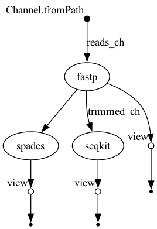

# my-wf: BIOL7210 Nextflow DSL2 Pipeline

## Overview
A simple bacterial‑genomics pipeline demonstrating both sequential and parallel execution:
1. **Trim & QC** with **fastp**  
2. **Assemble** with **SPAdes** (runs after trimming)  
3. **Compute read metrics** with **seqkit** (runs in parallel with SPAdes)

## Workflow 


## Requirements
- **Nextflow** v24.10.5  
- **Conda** (Miniforge/Mambaforge)  
- **Java** JRE 11+ (bundled with Nextflow)  
- **Graphviz** (for DAG image)  

## Installation

1. **Clone** your repo and `cd` into it  
2. **Create & activate** the Conda environment:
   ```bash
   conda env create -f envs/conda.yaml
   conda activate nf-wf
   ```
## Test data
test_data/mini.fastq.gz

## Env File
envs/conda.yaml

## Directory structure

my-wf/
├── main.nf
├── nextflow.config
├── modules/
│   ├── fastp/main.nf
│   ├── spades/main.nf
│   └── seqkit/main.nf
├── envs/conda.yaml
├── test_data/mini.fastq.gz
├── workflow_dag.png
└── README.md


## Running
### Test run
```bash
nextflow run main.nf \
  -profile test,conda \
  --reads test_data/mini.fastq.gz \
  -with-report report.html
```
### Full run 
```bash
nextflow run main.nf \
  -profile conda \
  --reads "/path/to/reads/*.fastq.gz" \
  -with-report report.html
```
